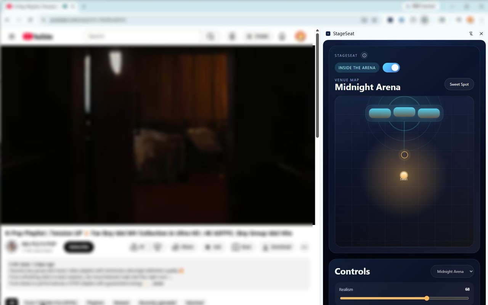

# StageSeat

StageSeat is a Chrome extension that lets you hear the current tab from different virtual seat positions in a venue.

Instead of exposing a dense audio panel, StageSeat turns position into sound: drag the listener point, move closer to the stage, slide toward the sides, or snap back to the sweet spot and hear the room change in real time.

## Highlights

- Re-shapes the current tab's audio based on venue position
- Uses a draggable seat map instead of audio jargon-heavy controls
- Blends direct sound, early reflections, and late reverb in realtime
- Shows stage energy and listener impact inside a tab-specific side panel
- Keeps audio local to the browser and does not save or export audio

## How to use

1. Open a tab that is actively playing audio, such as YouTube.
2. Click the StageSeat toolbar icon on that tab.
3. The side panel for that tab opens.
4. Turn the engine on inside the panel.
5. Drag the `Seat` point around the venue map or hit `Sweet Spot` to compare positions.

## How it works

- `chrome.tabCapture` captures audio from the current tab after explicit user action.
- An offscreen document hosts the Web Audio pipeline so processing can continue while the source tab stays active.
- Position in the venue map is translated into direct sound, early reflections, late reverb, stereo balance, and distance cues.
- The side panel visualizes energy and exposes a small set of controls: venue, realism, energy, and power.

## Permissions

- `activeTab`: lets the user arm the current tab with a click
- `tabCapture`: captures the current tab's audio stream
- `tabs`: keeps track of the source tab and its title
- `offscreen`: runs the background audio engine
- `sidePanel`: renders the tab-specific StageSeat UI
- `storage`: stores venue and control settings locally

## Project layout

- `src/background/`: session lifecycle and Chrome extension events
- `src/offscreen/`: Web Audio graph and realtime audio processing
- `src/sidepanel/`: React UI, drag interactions, and venue visualization
- `src/shared/`: presets, shared message contracts, reducer logic, and acoustic mapping

## Local development

1. Run `npm install`
2. Run `npm run build`
3. Open `chrome://extensions`
4. Enable `Developer mode`
5. Click `Load unpacked`
6. Select the generated `dist` folder

For active development, run `npm run dev` and refresh the extension from `chrome://extensions` after each rebuild.

## Commands

- `npm run build`: build the extension into `dist/`
- `npm run dev`: watch build output continuously
- `npm run lint`: run ESLint
- `npm run test`: run Vitest unit tests

## Limitations

- Target browser: Chrome Desktop 116+
- First-time authorization comes from clicking the extension action on the source tab
- Protected or unsupported pages may refuse capture
- The extension does not save, export, upload, or download audio

## License

MIT
